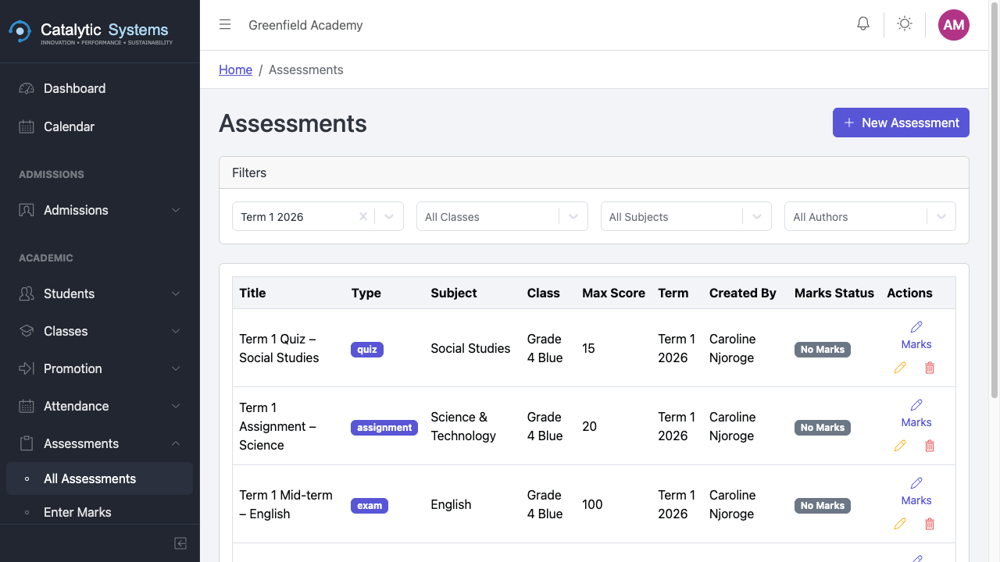
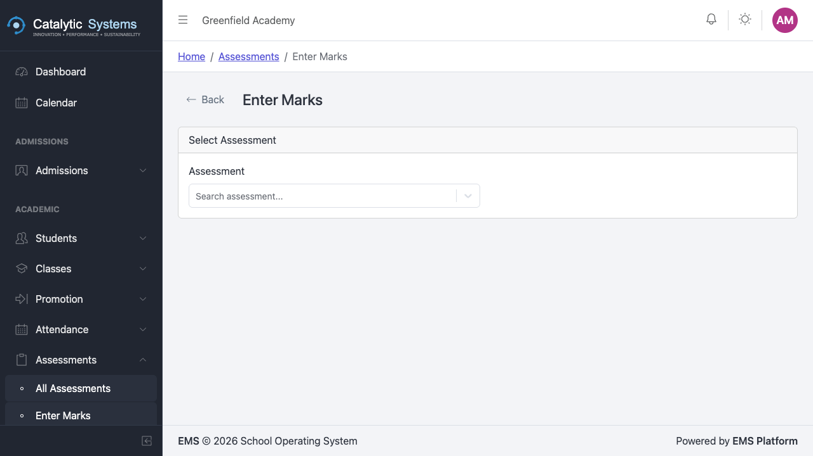

# Assessments

School Admin Teacher

The Assessments module manages tests, exams, and continuous assessment tasks (CATs). Teachers enter marks which feed directly into the Report Packs module.

## Creating an Assessment

1. Go to **Academic → Assessments**.
2. Click **New Assessment**.
3. Fill in the details:

| Field | Description |
|-------|-------------|
| **Name** | e.g. "Term 1 Mid-term Exam" |
| **Type** | Exam, CAT, Assignment, Practical, etc. |
| **Subject** | The subject being assessed |
| **Class** | The class being assessed |
| **Total Marks** | Maximum possible score |
| **Date** | Date of the assessment |
| **Assessment Group** | Group this belongs to (for report weighting) |

4. Click **Save**.

## Entering Marks

1. Open an assessment from the list.
2. Click **Enter Marks**.
3. The student list for the class is shown. Enter each student's score.

:::tip
Use **Tab** to move between score fields quickly. Scores that exceed the total marks are highlighted in red.
:::

4. Click **Save Marks**.

## Assessment Groups

Assessment groups allow you to weight different assessment types in report calculations (e.g. exams count for 70%, CATs count for 30%).

Go to **Settings → Assessment Groups** to configure groups and their weights.

## Grading

EMS can automatically convert numerical scores to letter grades and comments based on your school's grading scale.

Go to **Settings → Grading** to set up your grading scale.

## Related Pages

- [Report Packs →](../reports/report-packs)
- [Settings → Grading →](../administration/settings)
