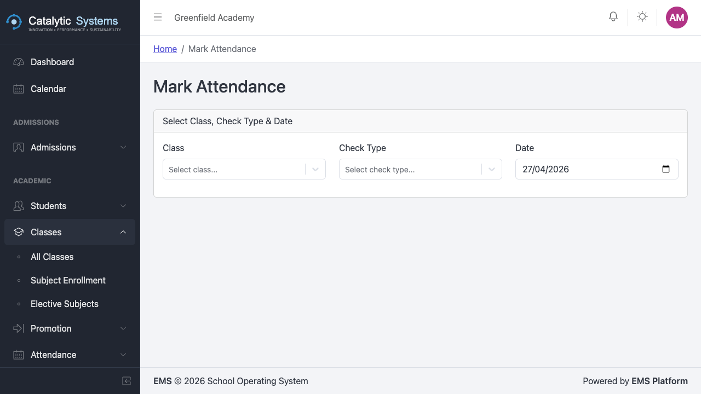

# Attendance

School Admin Teacher

The Attendance module lets teachers mark daily or period-by-period attendance for their classes, and gives school administrators a full overview of attendance across the school.

## Marking Attendance

### As a Teacher

1. Go to **Academic → Attendance**.
2. Your assigned classes are listed. Click the class you want to mark.
3. Select the **date** (defaults to today).
4. The full student list loads automatically.

5. For each student, click their status:
   - **P** — Present
   - **A** — Absent
   - **L** — Late
   - **E** — Excused

6. Optionally click the **note icon** next to a student to add a reason for absence.
7. Click **Save Attendance**.

:::tip[Quick mark]
Use the **Mark All Present** button at the top to mark the entire class present, then adjust individual students who are absent. This is faster for classes with high attendance.
:::

:::note
Once attendance is saved for a date, it can be edited by the teacher until the end of the school day. After that, only a School Admin can make changes.
:::

### Mobile Attendance

Teachers can also mark attendance from their phone using the mobile-optimised attendance view. The interface is the same but optimised for touch.

## Attendance Reports

School Admins can view attendance reports across the school:

1. Go to **Academic → Attendance → Reports**.
2. Filter by **class**, **date range**, or **student**.
3. Export to CSV or print the report.

## Attendance Compliance

The compliance view shows classes that have **not had attendance marked** for the current day. School admins use this to chase up teachers who have missed marking.

Go to **Academic → Attendance → Compliance** to see the compliance dashboard.

## Check Types

Some schools mark attendance multiple times per day (e.g. morning and afternoon). Go to **Settings → Attendance Check Types** to configure these.

## Related Pages

- [Exit Passes →](./exit-passes)
- [Students →](./students)
- [Reports →](../reports/overview)
