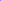

# Students

School Admin

The Students module is the central registry for all enrolled students. Every other module — attendance, assessments, fees, reports — references student records.

## Viewing Students

Go to **Academic → Students** to see the full student list.

Use the **search bar** to find a student by name or admission number. Use the **Class** filter to narrow the list to a specific class.

## Adding a Student

1. Click **Add Student**.
2. Fill in the student's details:

| Section | Fields |
|---------|--------|
| **Personal** | Full name, date of birth, gender, nationality, religion |
| **Admission** | Admission number, date of admission, class |
| **Contacts** | Guardian name, relationship, phone, email |
| **Medical** | Blood group, known conditions, emergency contact |

3. Upload a **passport photo** (optional but recommended).
4. Click **Save**.

:::tip Admission number
If you leave the admission number blank, EMS will auto-generate one based on the year and a sequence. You can override this with your school's numbering format in Settings.
:::

## Editing a Student

Click a student's name to open their **profile page**, then click **Edit** to modify their details.

## Bulk Import

To import multiple students at once from a spreadsheet:

1. Click **Load Data → Students** in the sidebar.
2. Download the **CSV template**.
3. Fill in your data and upload the file.
4. Review the preview and click **Import**.

## Student Profile

The student profile is a unified view of everything about a student:

- Personal details and contact information
- Current class and academic history
- Attendance summary
- Fee account and payment history
- Assessment results
- Documents and uploads

## Bulk Class Assignment

To move multiple students to a different class:

1. On the Students list, check the students you want to move.
2. Click **Bulk Assign Class**.
3. Select the target class and confirm.

## Related Pages

- [Classes →](./classes)
- [Progression / Promotion →](./progression)
- [Attendance →](./attendance)
