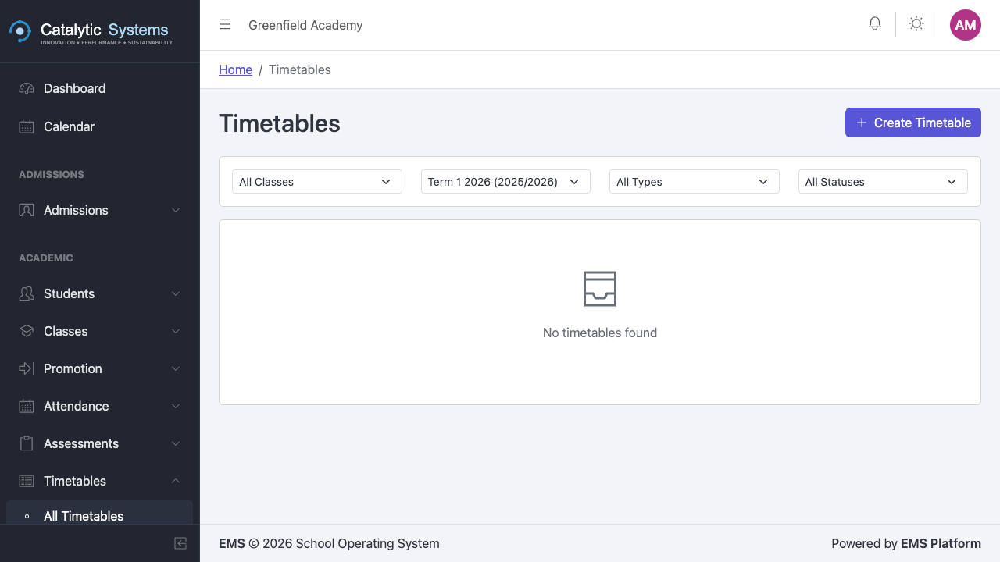
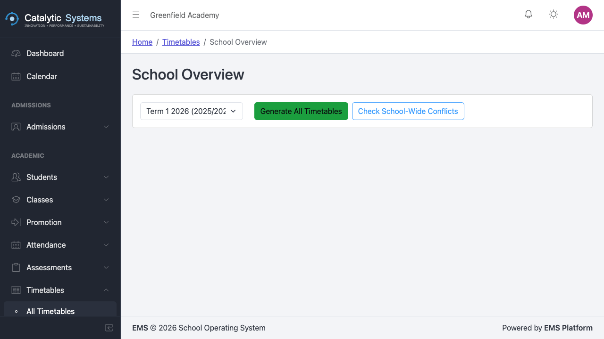
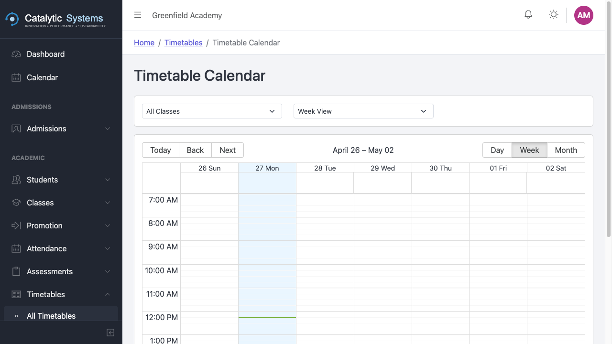

# Timetables

School Admin

The Timetables module provides a visual drag-and-drop builder for creating and managing class schedules. Once published, teachers and students can view their personal timetables.

## Creating a Timetable

1. Go to **Academic → Timetables**.
2. Click **New Timetable**.
3. Give the timetable a name and select the **term** it covers.
4. Click **Save** to open the timetable builder.

## Using the Timetable Builder

The builder shows a grid of **classes (rows)** × **periods (columns)**.

To assign a lesson:
1. Click an empty cell in the grid.
2. Select the **subject**, **teacher**, and **room** for that period.
3. Click **Save** — the cell is filled with the lesson details.

To move a lesson:
- **Drag and drop** it to another cell. The system will warn you if there is a teacher or room conflict.

## Periods Configuration

Define your school's daily period structure under **Settings → Timetable Periods**:
- Period name (Period 1, Break, Lunch, etc.)
- Start and end time
- Whether it is a teaching period or a break

## Conflict Detection

The timetable builder automatically detects:
- **Teacher conflicts** — same teacher assigned to two classes at the same time
- **Room conflicts** — same room assigned to two classes at the same time

Conflicts are highlighted in red. Resolve them before publishing.

## Publishing a Timetable

Once complete, click **Publish** to make the timetable visible to teachers. Published timetables appear on each teacher's personal timetable view.

## Teacher Timetable View

Teachers can view their personal timetable from **Academic → Timetables → My Timetable** — showing only their lessons, rooms, and classes.

## School Overview

The **School Overview** shows all classes and their schedules side by side — useful for spotting gaps or overloaded days.

## Compliance

The compliance report shows which classes have unfilled periods, helping ensure every class has a full teaching schedule before the term starts.

## Related Pages

- [Classes →](./classes)
- [Staff →](../administration/staff)
- [Electives →](./electives)
