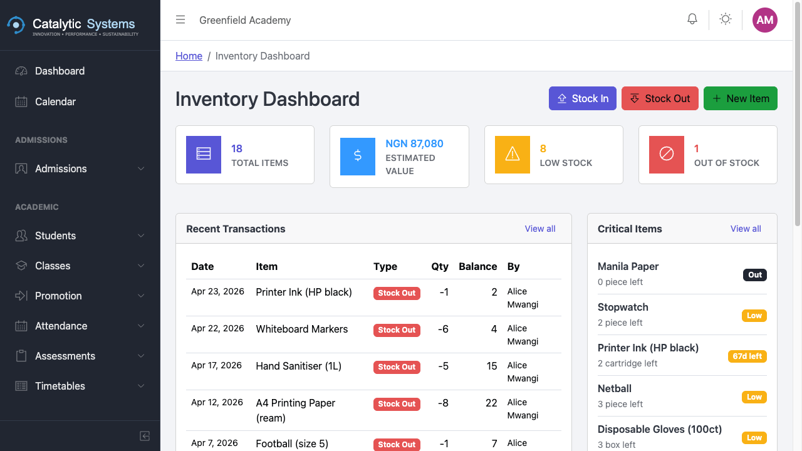
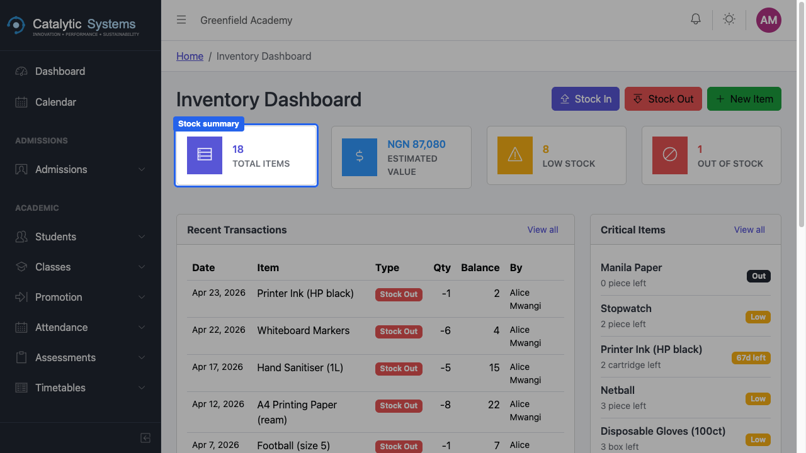
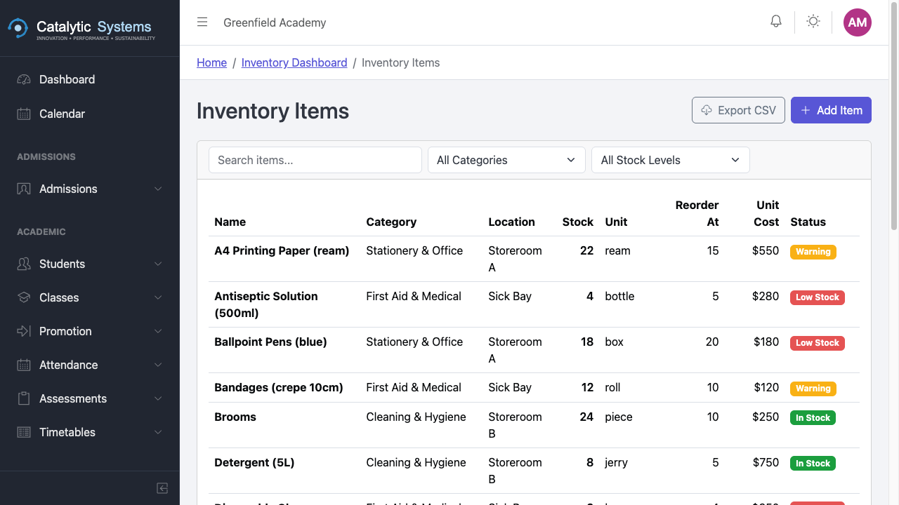
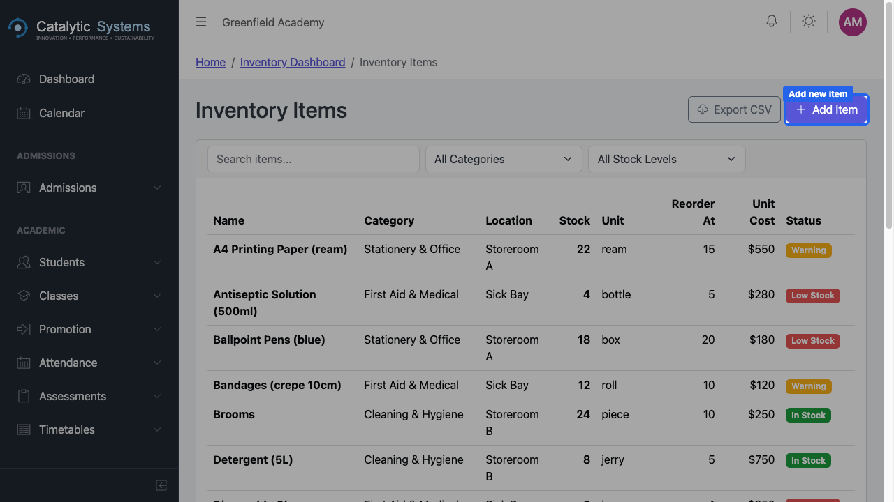
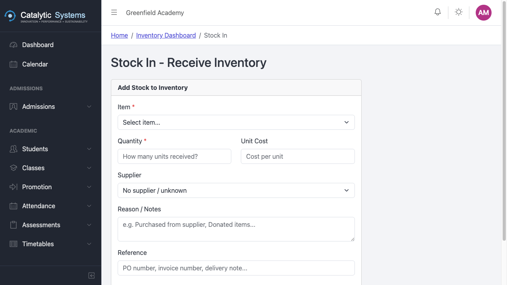
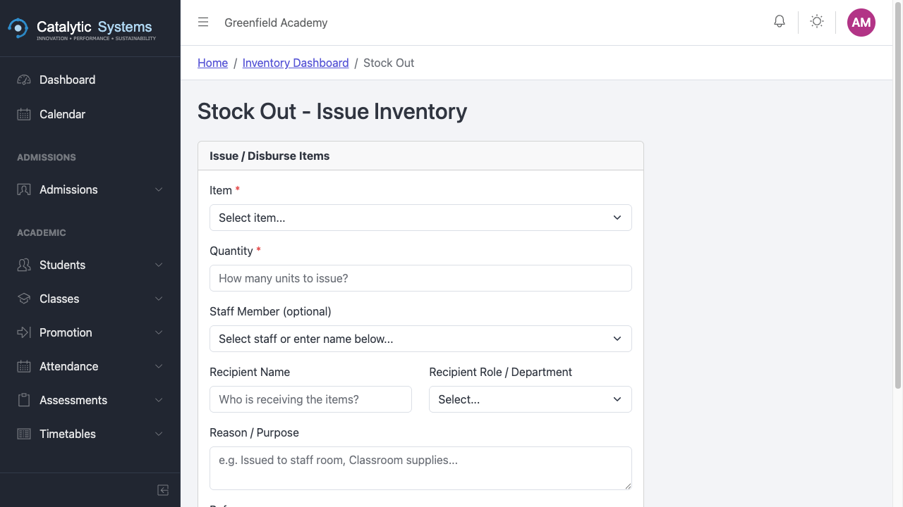
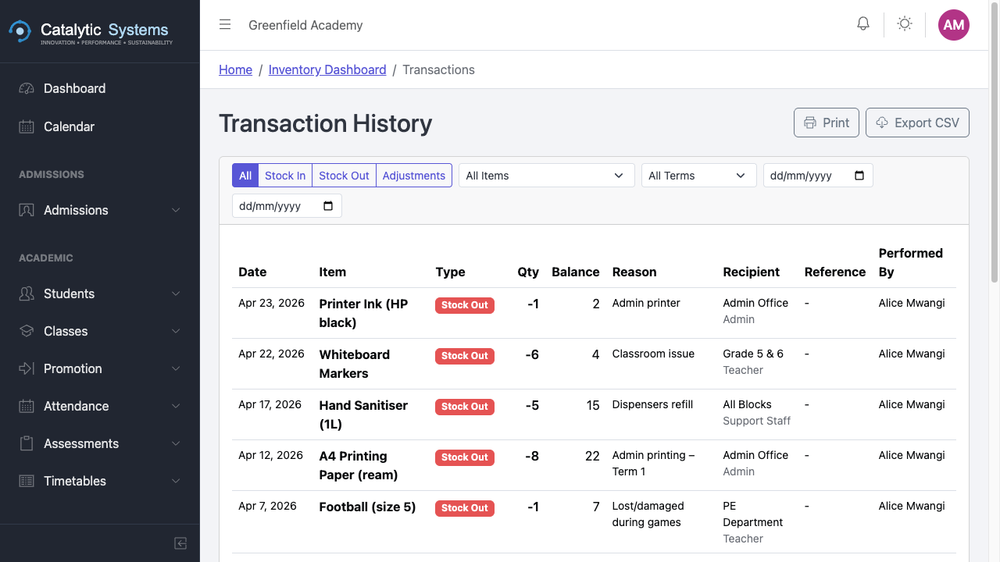
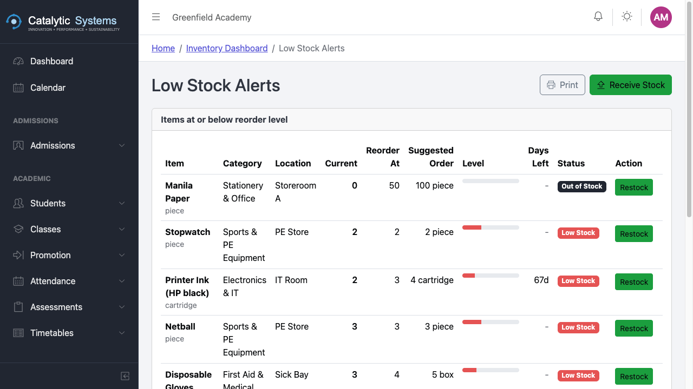
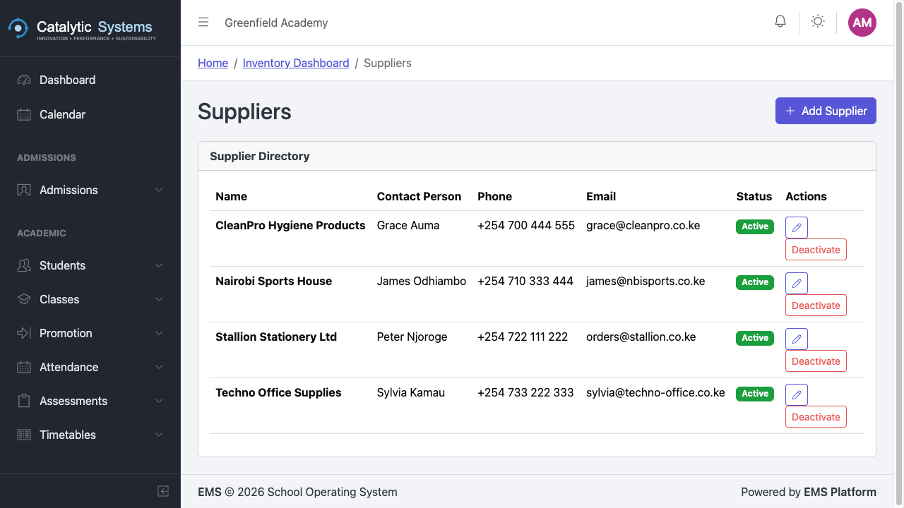
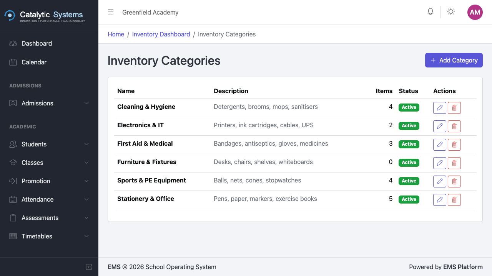

# Inventory

School Admin

The Inventory module tracks school assets and consumable stock — from textbooks and sports equipment to stationery and cleaning supplies.

## Inventory Dashboard

Go to **Administration → Inventory** to see the inventory dashboard with:
- Total items in stock
- Low stock alerts
- Recent stock movements

## Adding an Item

1. Click **New Item**.
2. Fill in:

| Field | Description |
|-------|-------------|
| **Item Name** | e.g. "A4 Printing Paper (Ream)" |
| **Category** | Stationery / Books / Equipment / Furniture / Other |
| **Unit** | Ream, piece, box, set, etc. |
| **Reorder Level** | Quantity at which a low-stock alert is triggered |
| **Supplier** | Preferred supplier for this item |

3. Click **Save**.

## Recording Stock In

When new stock arrives:
1. Go to **Administration → Inventory → Stock In**.
2. Select the item.
3. Enter the quantity received and the date.
4. Optionally link to a purchase order/reference.
5. Click **Save**.

## Recording Stock Out

When stock is used or distributed:
1. Go to **Administration → Inventory → Stock Out**.
2. Select the item and enter the quantity used.
3. Add a note on what it was used for.
4. Click **Save**.

## Movement Report

The movement report shows a chronological log of all stock in and stock out for any item. Go to **Administration → Inventory → Movement Report** and filter by item or date range.

## Low Stock Report

The low stock report lists all items at or below their reorder level. Use this for procurement planning.

## Suppliers

Manage supplier contacts in **Administration → Inventory → Suppliers**.

## Categories

Organise items into categories for easier reporting and filtering.

## Related Pages

- [Expenses →](../finance/expenses)
- [Requisitions →](../finance/requisitions)
