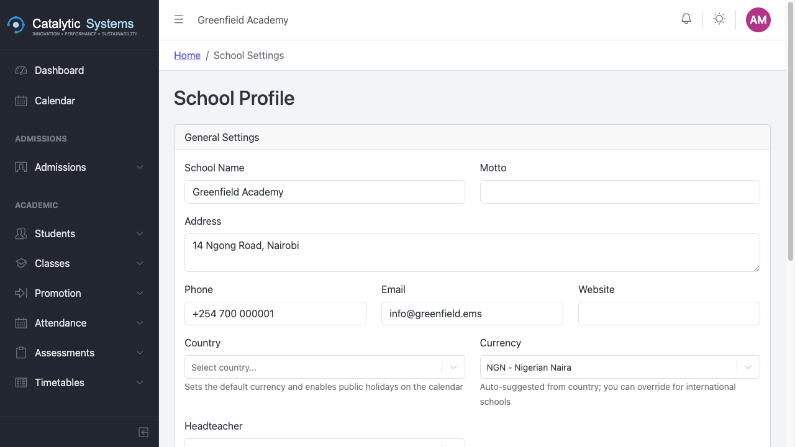
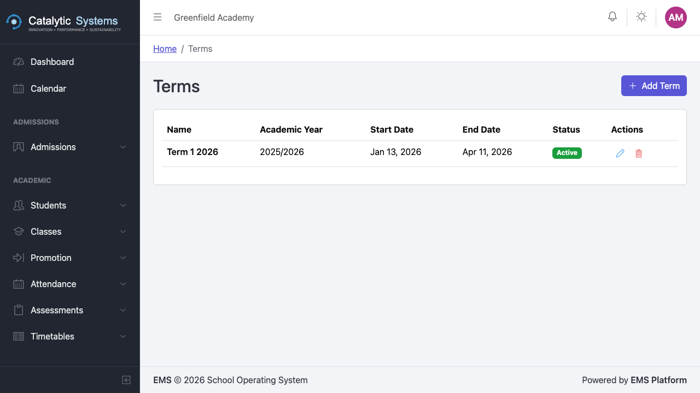
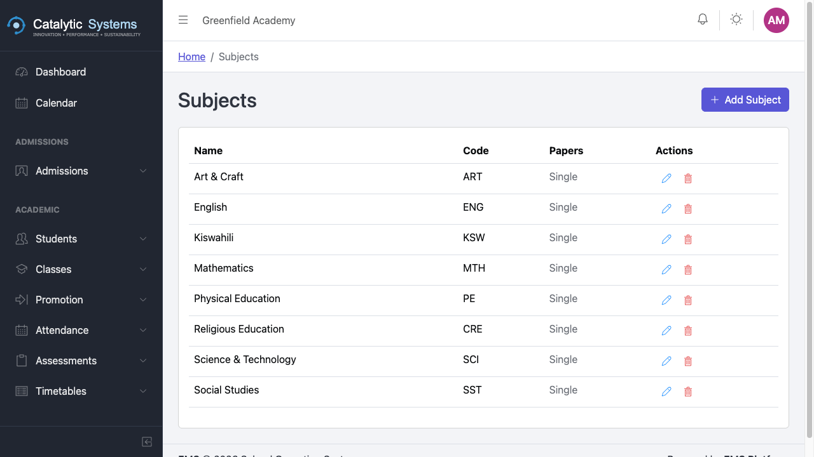
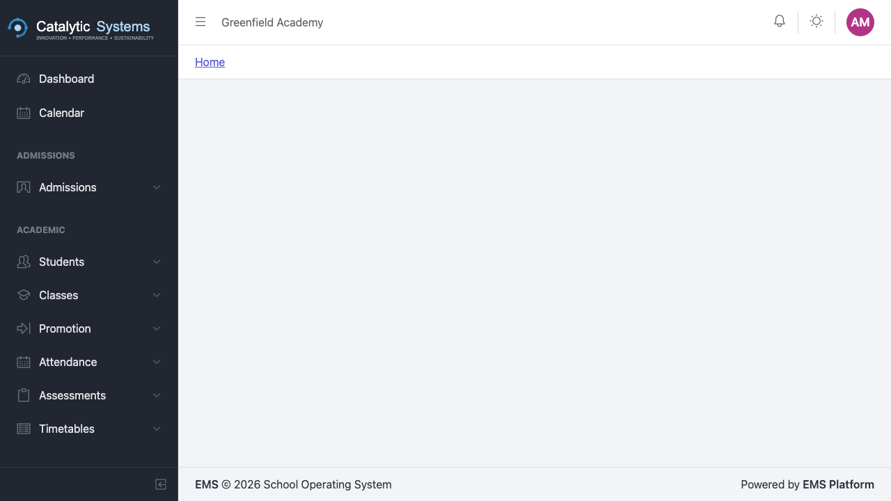
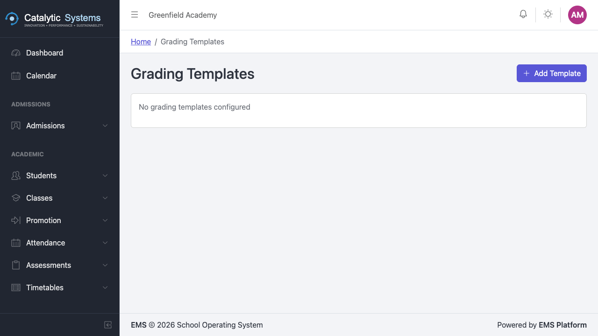
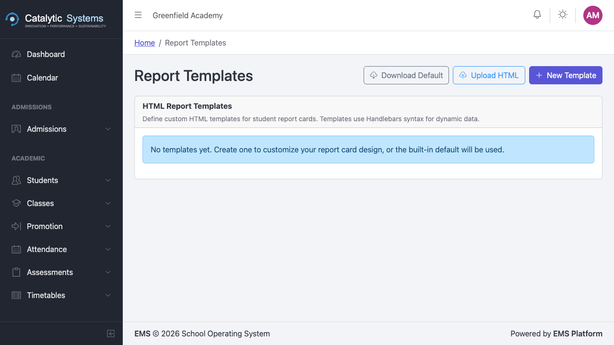

# Settings & Configuration

School Admin

The Settings module is where School Admins configure system-wide options that affect all modules. Most settings are configured once and rarely changed.

## School Profile

Go to **Settings → School Profile** to update:
- School name, logo, and motto
- School address and contact details
- School code (used in the admissions portal URL)
- Default currency

## Terms

Terms define the academic calendar — each term has a start date, end date, and name.

1. Go to **Settings → Terms**.
2. Click **New Term**.
3. Set the name (e.g. "Term 1 2026"), start date, and end date.
4. Mark one term as **Active** — this is the term most modules default to.

:::warning
Only one term can be Active at a time. Changing the active term affects the default view across attendance, fees, assessments, and timetables.
:::

## Subjects

Manage the subjects offered by your school:
1. Go to **Settings → Subjects**.
2. Click **New Subject** and enter the subject name and code.

Subjects are then available for class enrolment, timetabling, and assessments.

## Staff & Users

Manage staff accounts and roles under **Settings → Staff/Users**. You can add new users, assign roles, and deactivate accounts.

## Grading

Configure your school's grading scale:
1. Go to **Settings → Grading**.
2. Define grade boundaries — e.g. 80–100% = A, 65–79% = B, etc.
3. Add comments or descriptors for each grade.

This grading scale is applied automatically in Report Packs.

## Grading Templates

Configure your grading scale once and it applies consistently across all assessments and report packs.

## Report Templates

Customise the layout and content of student report cards:
1. Go to **Settings → Report Templates**.
2. Use the template editor to add school logo, headers, subject columns, comment fields, and signature blocks.

## Attendance Check Types

If your school marks attendance multiple times per day:
1. Go to **Settings → Attendance Check Types**.
2. Add check types (e.g. "Morning", "Afternoon").
3. Set the expected time for each check.

## Timetable Settings

Configure timetable rules and period structures under:
- **Settings → Timetable Periods** — define the daily period schedule
- **Settings → Timetable Rules** — set constraints (e.g. max periods per day per teacher)

## Related Pages

- [Terms → Academic](../academic/progression)
- [Grading → Assessments](../academic/assessments)
- [Report Templates → Report Packs](../reports/report-packs)
