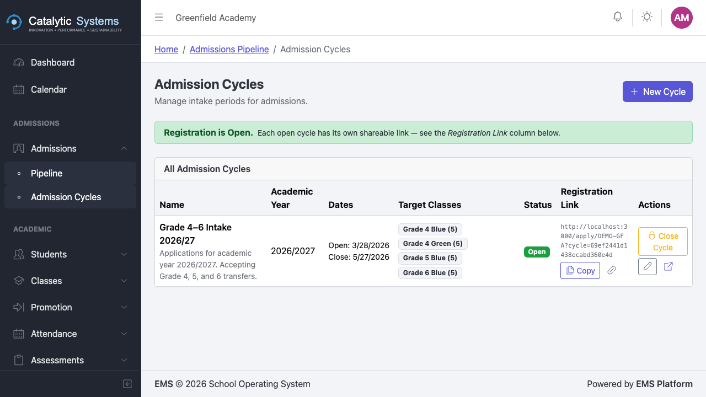

# Admission Cycles

School Admin

An **admission cycle** defines a specific intake period — for example, "2026 Grade 1 Intake". Each cycle has a defined capacity, application window, and target class level.

## Creating an Admission Cycle

1. Go to **Admissions** in the sidebar.
2. Click **Admission Cycles**.
3. Click **New Cycle**.

4. Fill in the cycle details:

| Field | Description |
|-------|-------------|
| **Cycle Name** | Descriptive name, e.g. "2026 Form 1 Intake" |
| **Academic Year** | The term this intake feeds into |
| **Target Class** | The class level applicants will join |
| **Total Capacity** | Maximum number of places available |
| **Open Date** | When applications open on the portal |
| **Close Date** | Application deadline |
| **Status** | Draft → Active → Closed |

5. Click **Save**.

## Activating a Cycle

A cycle must be **Active** for the public portal to accept applications. Change the status from **Draft** to **Active** when you are ready to open applications.

:::warning
Setting a cycle to **Closed** will immediately stop accepting new applications from the portal. Existing applications are not affected.
:::

## Monitoring a Cycle

From the cycles list, you can see:
- Total applications received
- Applications by status (pending, shortlisted, admitted, rejected)
- Remaining capacity

Click a cycle to open the **Application Pipeline** for that cycle.

## Related Pages

- [Application Pipeline →](./application-pipeline)
