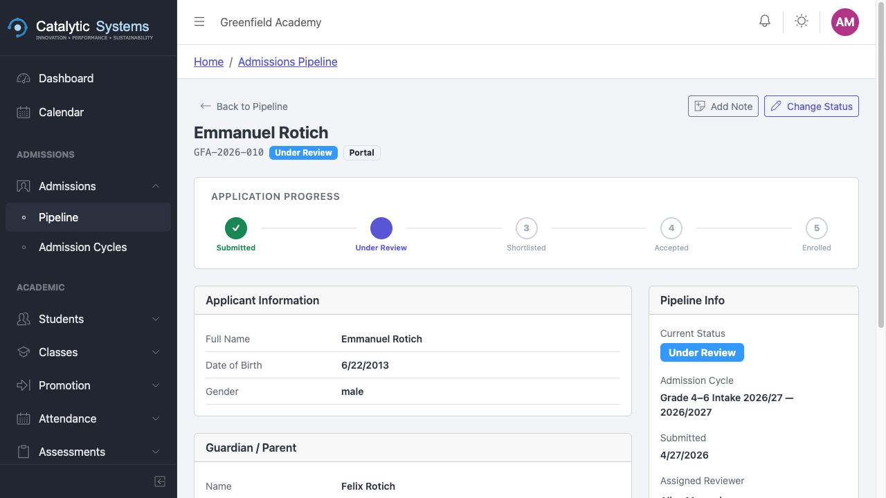

# Application Pipeline

School Admin

The Application Pipeline is where you review, manage, and decide on student applications for a given admission cycle.

## Viewing Applications

1. Go to **Admissions → Application Pipeline**.
2. Select the **Admission Cycle** from the dropdown.
3. All applications for that cycle are listed with their current status.

## Application Statuses

| Status | Meaning |
|--------|---------|
| **Pending** | Received, not yet reviewed |
| **Under Review** | Being assessed |
| **Shortlisted** | Conditionally approved, pending interview/test |
| **Admitted** | Accepted — student record will be created |
| **Rejected** | Application declined |
| **Withdrawn** | Applicant withdrew |

## Reviewing an Application

1. Click an application row to open the **Application Detail** view.
2. Review the submitted information: personal details, documents, guardian contacts.
3. Use the **Status** dropdown to update the application status.
4. Add an **internal note** if needed (not visible to applicants).
5. Click **Save**.

## Bulk Actions

To process multiple applications at once:
1. Check the checkboxes on the left of each row.
2. Use the **Bulk Action** dropdown to set status for all selected.
3. Click **Apply**.

## Admitting an Applicant

When you set an application to **Admitted**:
- EMS automatically creates a **Student record** for the applicant.
- The student is assigned to the target class specified in the admission cycle.
- A welcome notification is sent to the guardian's email.

:::tip
Review all application documents before admitting. Once admitted, the student record is live in the academic system.
:::

## Related Pages

- [Admission Cycles →](./admission-cycles)
- [Students →](../academic/students)
