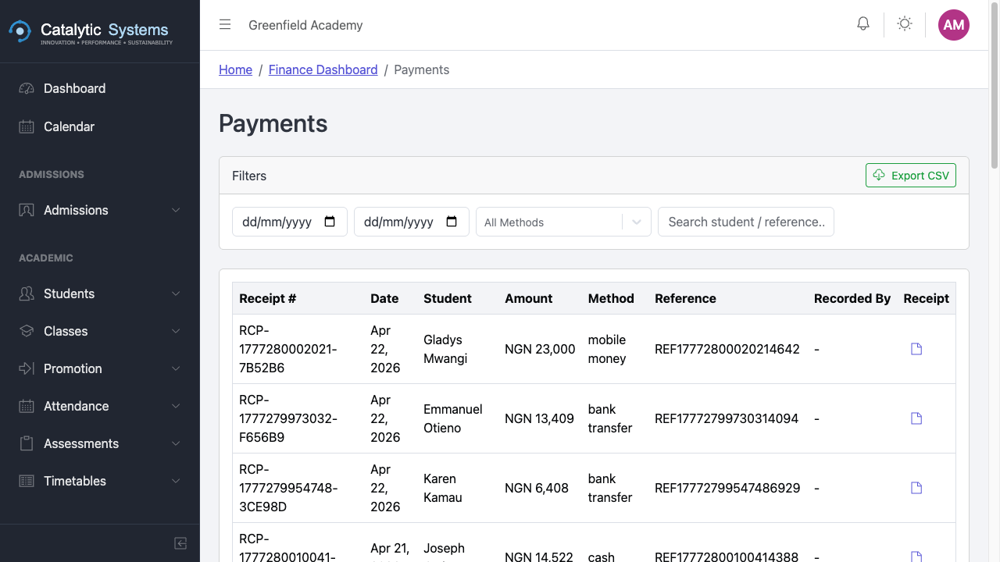
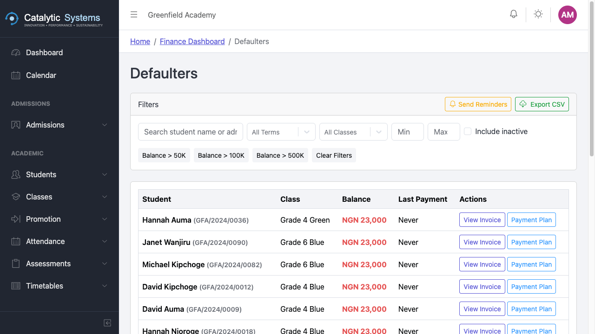

# Payments & Receipts

School Admin Bursar

The Payments module records all fee payments received from guardians and applies them to outstanding invoices.

## Recording a Payment

1. Go to **Finance → Payments**.
2. Click **New Payment**.
3. Search for the **student** by name or admission number.
4. The student's outstanding invoices load automatically.

5. Enter the payment details:

| Field | Description |
|-------|-------------|
| **Amount** | Amount received |
| **Payment Method** | Cash, Bank Transfer, Mobile Money, SchoolPay, Cheque |
| **Reference** | Bank reference or receipt number |
| **Date** | Date of payment |

6. The system allocates the payment to the oldest unpaid invoice first (FIFO). You can adjust the allocation manually.
7. Click **Save** — a receipt is generated automatically.

## Receipts

Every payment generates a **receipt** with a unique receipt number. You can:
- View it on screen
- Download as PDF
- Print directly
- Re-send to the guardian via email

## SchoolPay Integration

If your school uses **SchoolPay** (mobile money payments), payments made by guardians via SchoolPay are automatically imported into EMS. No manual entry needed.

Go to **Settings → SchoolPay** to configure your SchoolPay account linkage.

## Payment History

Click a student's invoice to see the full payment history — every payment applied, the date, amount, and method.

## Defaulters

The defaulters report shows students with outstanding balances.

1. Go to **Finance → Defaulters**.
2. Filter by **term**, **class**, or **minimum balance**.
3. Export the list or send bulk SMS/email reminders.

## Cashbook

The cashbook provides a chronological list of all money received, useful for daily reconciliation.

Go to **Finance → Cashbook** and select the date or date range.

## Related Pages

- [Invoicing →](./invoicing)
- [Payment Plans →](./payment-plans)
- [SchoolPay Setup →](../administration/settings)
