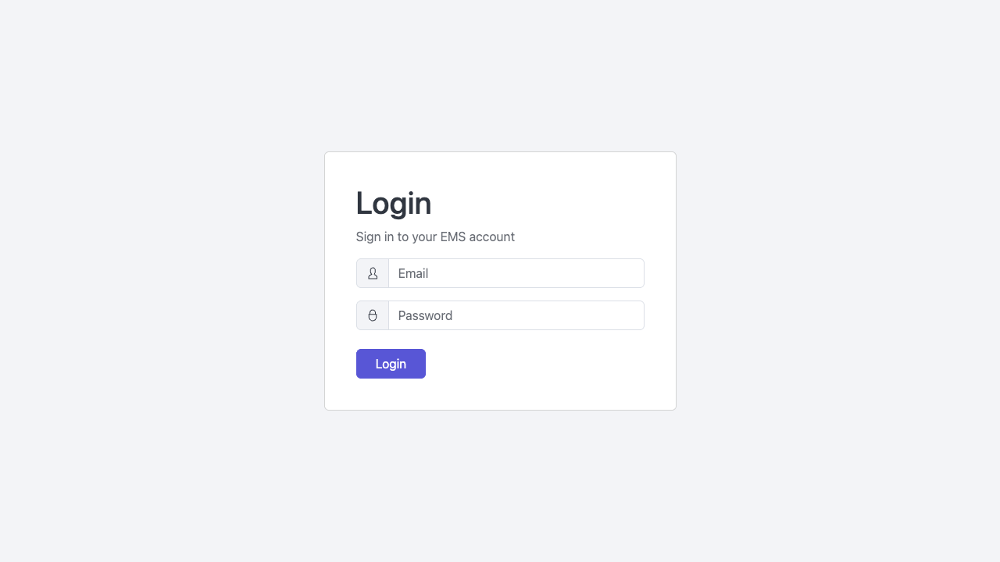

# Login & Navigation

## Logging In

1. Open your web browser and go to the EMS URL provided by your administrator (e.g. `https://app.ems.school`).
2. Enter your **Email Address** and **Password**.
3. Click **Sign In**.

:::tip[Forgot your password?]
Click **Forgot Password** on the login page. A reset link will be sent to your registered email address. If you do not receive the email within 5 minutes, check your spam folder or contact your school administrator.
:::

:::note[First-time login]
If this is your first time logging in, use the temporary password sent to your email and you will be prompted to set a new password immediately.
:::

## The Dashboard

After logging in you are taken to your **Dashboard**. The dashboard content varies by role:

- **School Admin** — school-wide stats, recent activity, pending tasks
- **Bursar** — financial summary, outstanding payments, recent transactions
- **Teacher** — today's classes, attendance due, pending assessments

## Navigating the Sidebar

The **left sidebar** is the primary navigation for the system. It is organised into sections that match your role's access.

| Sidebar Section | Contents |
|-----------------|---------|
| Dashboard | Home / overview |
| Admissions | Pipeline, cycles, portal |
| Academic | Students, classes, attendance, timetables, etc. |
| Finance | Fees, invoices, payments, budgets, etc. |
| Administration | Staff, parents, inventory |
| Communication | Inbox, documents |
| Analytics | Reports, report packs |
| Configuration | Settings, load data |

Click any menu item to navigate to that module. Items with a **chevron (›)** have sub-pages — click to expand the section.

### Collapsing the Sidebar

Click the **hamburger icon** (☰) at the top of the sidebar to collapse it to icons only. This gives you more screen space on smaller monitors. Click it again to expand.

## Switching Between Schools (Super Admin Only)

If you are a Super Admin, you can switch into a school's tenant context using the **school switcher** at the top of the platform panel. Select a school from the dropdown to view it as a school-level admin.

## Logging Out

Click your **profile avatar** in the top-right corner, then click **Logout**. Your session ends immediately and you are returned to the login page.

:::warning[Inactivity timeout]
EMS sessions expire after 60 minutes of inactivity for security. Save your work before stepping away.
:::

## Next Steps

- [Roles & Permissions →](./roles-and-permissions)
- [Getting Started with Academics →](../academic/students)
